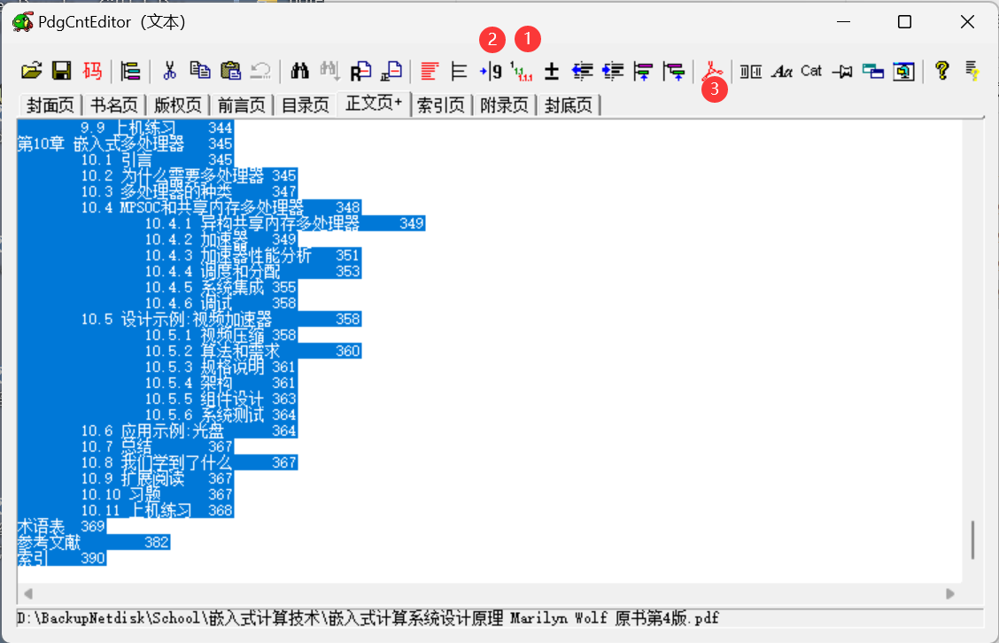
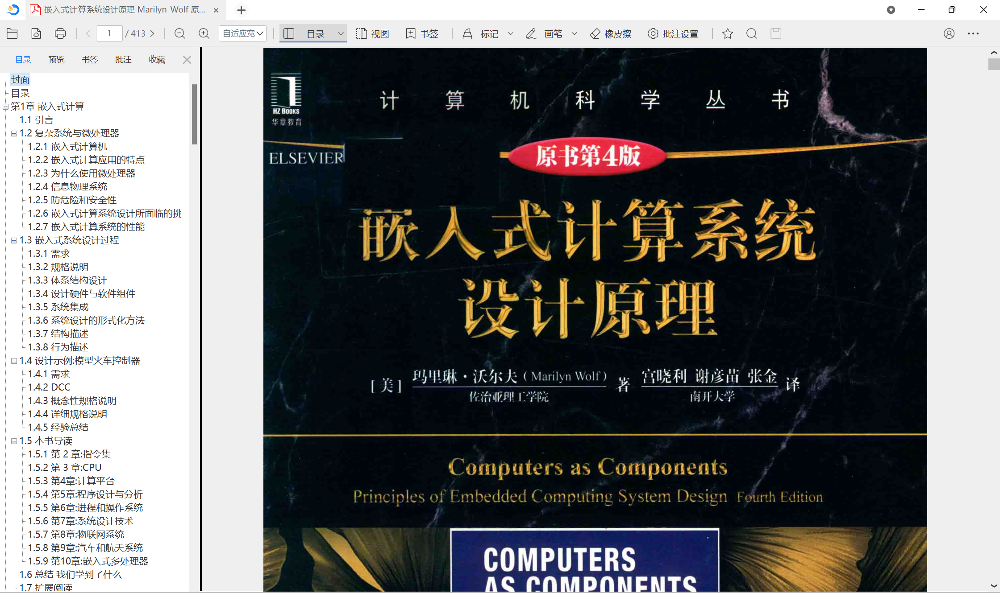

<!-- #! https://zhuanlan.zhihu.com/p/661004681
# 扫描版 PDF 目录制作指南 -->

目前网上找到的扫描版的电子书往往没有目录，阅读较为困难。本文总结我的经验，介绍快速制作扫描版 PDF 目录的方法，以便更轻松地阅读扫描版电子书。

本文首先介绍手动制作目录的方法，之后介绍如何利用 AI 帮助制作目录，接下来介绍了没有目录页的扫描版 PDF 的解决方案。本文提到的软件我都放在 [网盘](https://pan.baidu.com/s/1nQEAKnuNcf2KxrAz473xIA?pwd=1234) 中分享
<https://pan.baidu.com/s/1nQEAKnuNcf2KxrAz473xIA?pwd=1234>

## 目录 OCR

制作目录，首先要对扫描版电子书的目录页进行 OCR。

OCR 软件首推 **PDF_XChange**，该软件我已放到网盘中。OCR 方式如图所示


其次推荐 ABBYY FineReader PDF 15、Adobe acrcbat dc、扫描全能王等软件。

## 格式化目录

获得目录 ocr 结果后，可以先通过**替换**把 `..` 全部去掉


之后**去除中文字符间的空格**。具体方法为**打开 word 文档或 WPS**，粘贴 OCR 内容，在替换框中选择 `使用通配符`，在查找内容中输入 `([一-龥]) ([一-龥])`，在替换为中输入 `\1\2`，最后选择全部替换，此时 Word 将会找到所有匹配的两个汉字之间有一个空格的情况，并将空格去除，保留两个汉字。


之后是对照扫描版电子书**格式化目录**，最终转化成如下格式

```txt
第 1 章 嵌入式计算 1
1.1 引言 1
1.2 复杂系统与微处理器 1
1.2.1 嵌入式算机 2
......
```

然后用 **PdgCntEditor** 打开 PDF 文件，粘贴格式化的目录结果，按图所示依次点击



对应操作为

1. 自动层次化目录
2. 分割页码
3. 设置基准页，即书的第 1 页在 PDF 文件中的页码

最后按 `Ctrl+S` 保存，可以看到目录已经制作完成



## AI 帮助提取格式化目录

目录页 OCR 的结果已包含目录的全部信息，手动整理目录纯粹是个体力活，因此格式化目录可以借助 AI 完成。

经过我的多次试验，我发现比较好用的 Prompt 如下

```txt
您是一名经验丰富的图书管理员，正在参与一个将纸质书籍转化为电子书的项目。您的具体任务是利用 OCR 技术扫描书籍目录，并对扫描结果进行格式化处理，以制作电子目录。我将向您提供一份目录的 OCR 扫描结果，您需要根据这些信息输出格式化的目录文本。格式化的目录应该包括章节编号、标题和页码。

一个您预期的格式化目录的示例如下：

第 3 章 应力和应变分析 54
 3.1 应力分析 54
  3.1.1 应力张量及其分解 54
  3.1.2 主应力和应力不变量 56
  3.1.3 等斜面上的应力 57
  3.1.4 等效应力 58
  3.1.5 三向 Mohr 圆和 Lode 应力参数 59
  3.1.6 应力空间和主应力空间 61
 3.2 应变分析 62
  3.2.1 位移与应变的关系 62
  3.2.2 应变张量的分解和应变张量的不变量 63
  3.2.3 等效应变和 Lode 应变参数 64
  3.2.4 应变率张量和应变增量张量 65
 参考文献 66
 习题 66
第 4 章 屈服条件 68
 4.1 初始屈服条件 68
 4.2 两种常用的屈服条件 71
  4.2.1 Tresca 屈服条件 71
  4.2.2 Mises 屈服条件 74
  4.2.3 两种屈服条件的比较 74
  4.2.4 Mises 屈服条件的物理解释 76
 4.3 屈服条件的实验验证 77
 4.4 后继屈服条件 80
 参考文献 83
 习题 83
第 5 章 塑性本构关系 85
 5.1 弹性本构关系 85
 5.2 Drucker 公设 87
 5.3 加载、卸载准则 92
  5.3.1 理想塑性材料的加载、卸载准则 92
  5.3.2 强化材料的加载、卸载准则 93
 5.4 增量理论（流动理论） 93
  5.4.1 概述 93
  5.4.2 理想塑性材料与 Mises 条件相关联的流动法则 94
  5.4.3 理想塑性材料与 Tresca 条件相关联的流动法则 97
  5.4.4 强化材料的增量本构关系 99
 5.5 全量理论（形变理论） 101
  5.5.1 Илъюшин理论 101
  5.5.2 简单加载和单一曲线假定 102
  5.5.3 简单加载定理 104
  5.5.4 塑性本构关系的总结与比较 105
 5.6 岩土力学中的 Coulomb 屈服条件和流动法则 107
 参考文献 109
 习题 109

请确认您理解任务要求，并准备好接收 OCR 结果后，回复我“明白了”。然后我将发送 OCR 扫描的内容给您。
```

当然直接把目录图片发给 AI，利用其多模态能力也可以，参考 Prompt 如下：

```txt
您是一名经验丰富的图书管理员，正在参与一个将纸质书籍转化为电子书的项目。您的具体任务是完成结构化的电子目录。我将向您提供书籍目录扫描图片，您需要认真查看图片的内容，注意章节编号、标题和页码等信息，然后返回格式化的目录文本。您需要仔细检查目录文本与图片的内容是否一致。

一个您预期的格式化目录的示例如下：

第 3 章 应力和应变分析 54
 3.1 应力分析 54
  3.1.1 应力张量及其分解 54
  3.1.2 主应力和应力不变量 56
  3.1.3 等斜面上的应力 57
  3.1.4 等效应力 58
  3.1.5 三向 Mohr 圆和 Lode 应力参数 59
  3.1.6 应力空间和主应力空间 61
 3.2 应变分析 62
  3.2.1 位移与应变的关系 62
  3.2.2 应变张量的分解和应变张量的不变量 63
  3.2.3 等效应变和 Lode 应变参数 64
  3.2.4 应变率张量和应变增量张量 65
 参考文献 66
 习题 66
第 4 章 屈服条件 68
 4.1 初始屈服条件 68
 4.2 两种常用的屈服条件 71
  4.2.1 Tresca 屈服条件 71
  4.2.2 Mises 屈服条件 74
  4.2.3 两种屈服条件的比较 74
  4.2.4 Mises 屈服条件的物理解释 76
 4.3 屈服条件的实验验证 77
 4.4 后继屈服条件 80
 参考文献 83
 习题 83
第 5 章 塑性本构关系 85
 5.1 弹性本构关系 85
 5.2 Drucker 公设 87
 5.3 加载、卸载准则 92
  5.3.1 理想塑性材料的加载、卸载准则 92
  5.3.2 强化材料的加载、卸载准则 93
 5.4 增量理论（流动理论） 93
  5.4.1 概述 93
  5.4.2 理想塑性材料与 Mises 条件相关联的流动法则 94
  5.4.3 理想塑性材料与 Tresca 条件相关联的流动法则 97
  5.4.4 强化材料的增量本构关系 99
 5.5 全量理论（形变理论） 101
  5.5.1 Илъюшин理论 101
  5.5.2 简单加载和单一曲线假定 102
  5.5.3 简单加载定理 104
  5.5.4 塑性本构关系的总结与比较 105
 5.6 岩土力学中的 Coulomb 屈服条件和流动法则 107
 参考文献 109
 习题 109

请确认您理解任务要求，并准备好接收目录扫描图片后，回复我“明白了”。然后我将发送目录扫描图片给您。

```

## 没有目录页的扫描版 PDF

这种情况非常棘手，一种方案是使用软件 **PDF 补丁丁**，如图所示


其原理是识别扫描版 PDF 的 OCR 结果，然后根据字体的大小判断是否是标题，再生成目录。

另一种方案是利用 AI 读取整本书自动生成。

## 制作目录之后

之后是电子书的清晰化与压缩，这一步的教程网上有很多，比如玩转 pdf 之批量优化扫描版 PDF 书籍的清晰度<https://zhuanlan.zhihu.com/p/67762085>这篇文章。

最后是电子书的分享，比如可以上传到学校的资源库，如浙江大学课程攻略共享计划
<https://github.com/QSCTech/zju-icicles>

北大课程资料民间整理
<https://github.com/lib-pku/libpku>

也可以上传到 Z-Library
<https://zh.zlibrary-east.se/>

我也把我搜集的电子书都放在网盘中以供分享
<https://pan.baidu.com/s/1gaeV_OuJ-zdF9SkOiONvhA?pwd=1234>
