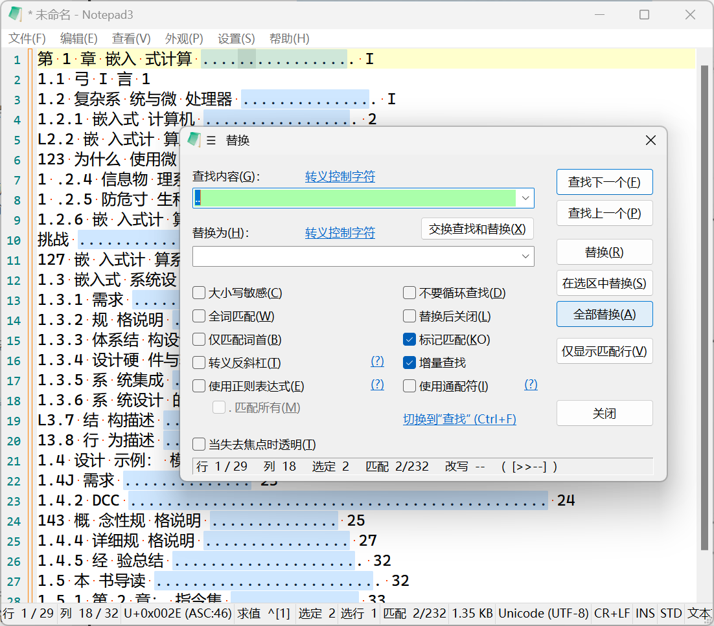
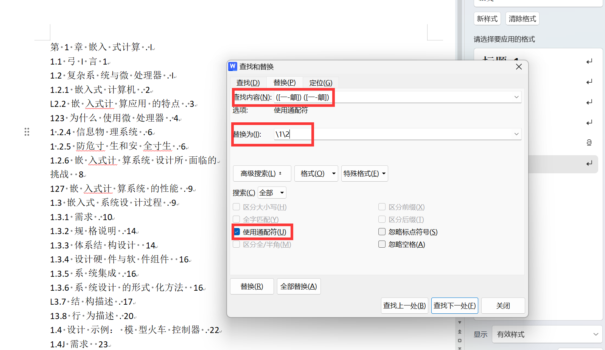

# 扫描版 PDF 目录制作指南

目前网上找到的扫描版的电子书往往没有目录，这使得阅读变得非常困难。本文总结我的经验，介绍快速制作扫描版 PDF 目录的方法，以便更轻松地阅读扫描版电子书。

本文提到的软件我都放在[网盘分享链接](https://pan.baidu.com/s/1nQEAKnuNcf2KxrAz473xIA?pwd=1234)中
https://pan.baidu.com/s/1nQEAKnuNcf2KxrAz473xIA?pwd=1234

## 目录 OCR

制作目录，首先要对扫描版电子书的目录页进行 OCR。

OCR 软件首推 **PDF_XChange**，该软件我已放到网盘中。OCR 方式如图所示


其次推荐 ABBYY FineReader PDF 15、Adobe acrcbat dc、扫描全能王等软件。

## 格式化目录

获得目录 ocr 结果后，可以先通过**替换**把 `..` 全部去掉



之后**去除中文字符间的空格**。具体方法为**打开 word 文档或 WPS**，粘贴 OCR 内容，在替换框中选择 `使用通配符`，在查找内容中输入 `([一-龥]) ([一-龥])`，在替换为中输入 `\1\2`，最后选择全部替换，此时 Word 将会找到所有匹配的两个汉字之间有一个空格的情况，并将空格去除，保留两个汉字。



之后是对照扫描版电子书**格式化目录**，最终转化成如下格式

```
第1章 嵌入式计算 1
1.1 引言 1
1.2 复杂系统与微处理器 1
1.2.1 嵌入式算机 2
......
```

然后用 **PdgCntEditor** 打开 PDF 文件，粘贴格式化的目录结果，按图所示依次点击


对应操作为

1. 自动层次化目录
2. 分割页码
3. 设置基准页，即书的第1页在PDF文件中的页码

最后按 `Ctrl+S` 保存，可以看到目录已经制作完成


## AI 帮助提取格式化目录

目录页 OCR 的结果已包含目录的全部信息，受到整理目录纯粹是个体力活，因此格式化目录可以借助 AI 完成。

经过我的多次试验，我发现比较用的 Prompt 如下

```
下面是目录ocr识别结果，请帮我整理成有序目录，注意保留页码信息

第 1 章 嵌入 式计算 . I
1.1 弓 I 言 1
1.2 复杂系 统与微 处理器 . I
1.2.1 嵌入式 计算机 . 2
L2.2 嵌 入式计 算应用 的特点 . 3
123 为什么 使用微 处理器 . 4
1 .2.4 信息物 理系统 . 6
1 .2.5 防危寸 生和安 全寸生 . 6
1.2.6 嵌 入式计 算系统 设计所 面临的
挑战  8
127 嵌 入式计 算系统 的性能 . 9
1.3 嵌入式 系统设 计过程 . 9
1.3.1 需求 . 10
1.3.2 规 格说明 . 14
1.3.3 体系结 构设计  14
1.3.4 设计硬 件与软 件组件  16
1.3.5 系 统集成 . 16
1.3.6 系 统设计 的形式 化方法  16
L3.7 结 构描述 . 17
13.8 行 为描述 . 20

...........................
...........................


比如，开始部分可以整理为

第1章 嵌入式计算 1
1.1 引言 1
1.2 复杂系统与微处理器 1
1.2.1 嵌入式算机 2

请继续整理第1、2、3、4、5、6、7、8、9、10章的目录内容，注意保留页码信息
```

至于具体选择哪个 AI，这里我推荐使用 **claude-2-100k** 帮忙整理目录。一方面，其能够一次性处理 10 万个字符，因此能够一次性整理好目录；另一方面 Poe 网站 https://poe.com/ 提供了每天 5 次的 claude-2-100k 使用机会，整理目录光靠白嫖就够了。

## 制作目录之后

之后是电子书的清晰化与压缩，这一步的教程网上有很多，比如玩转pdf之 批量优化扫描版PDF书籍的清晰度, https://zhuanlan.zhihu.com/p/67762085 这篇文章。

最后是电子书的分享，比如可以上传到学校的资源库，如浙江大学课程攻略共享计划
https://github.com/QSCTech/zju-icicles

北大课程资料民间整理
https://github.com/lib-pku/libpku

也可以上传到 Z-Library
https://zh.zlibrary-east.se/

